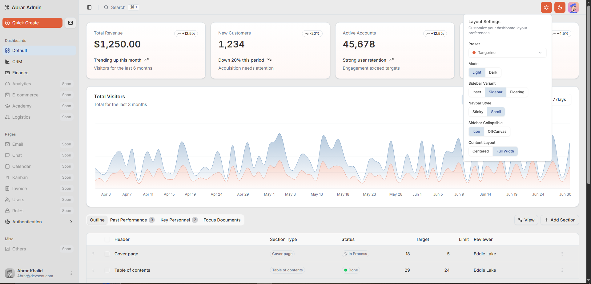

# Abrar Admin - Modern Next.js Dashboard Template

A modern, open-source dashboard starter template built with Next.js 16, Tailwind CSS v4, and shadcn/ui. Perfect for SaaS applications, admin panels, and internal tools—fully customizable and production-ready.

Most admin templates, free or paid, often feel cluttered, outdated, or too rigid. This template was built as a cleaner alternative with features often missing in others, such as theme toggling and layout controls, while keeping the design modern, minimal, and flexible.

This dashboard template provides a solid foundation for your next project with:
- Clean, modern UI design principles
- Responsive layouts that work on all devices
- Customizable themes and color schemes
- Comprehensive component library
- Performance-optimized code
- Accessibility built-in from the start

## Free to Use

This template is completely **free to use** for both personal and commercial projects. You can customize it, extend it, and build amazing applications with it without any restrictions. No hidden fees, no premium versions - just a high-quality dashboard template available for everyone.

## Request New Features

Have ideas for new features or improvements? I'm actively developing this template and welcome your input! Send your feature requests to:

📧 **Email**: [abrar@devscot.com](mailto:abrar@devscot.com)

I'll review all requests and consider them for future updates to make this template even better for the community.

## Features

- 🚀 **Next.js 16** - Built with the latest version of Next.js
- 💅 **Tailwind CSS v4** - For styling with utility classes
- 🧩 **shadcn/ui Components** - Beautiful, accessible UI components
- 🌓 **Dark Mode Support** - Seamless light/dark mode switching
- 📊 **Data Tables** - Powered by TanStack Table v8
- 📈 **Charts & Graphs** - Visualization with Recharts
- 🔄 **State Management** - Using Zustand for global state
- 📱 **Responsive Design** - Works on all devices
- 🧪 **Form Validation** - With React Hook Form and Zod
- 🔍 **Type Safety** - Full TypeScript support

## Getting Started

### Prerequisites

- Node.js 18.17.0 or later
- npm or yarn or pnpm

### Installation

1. Clone the repository:
   ```bash
   git clone https://github.com/abrarkhalidofficial/Modern-Admin-Dashboard-Template-built-with-Shadcn-UI-and-Next.js-16.git
   cd Modern-Admin-Dashboard-Template-built-with-Shadcn-UI-and-Next.js-16
   ```

2. Install dependencies:
   ```bash
   npm install
   # or
   yarn install
   # or
   pnpm install
   ```

3. Run the development server:
   ```bash
   npm run dev
   # or
   yarn dev
   # or
   pnpm dev
   ```

4. Open [http://localhost:3000](http://localhost:3000) in your browser to see the result.

## Available Scripts

- `npm run dev` - Start the development server
- `npm run build` - Build the application for production
- `npm run start` - Start the production server
- `npm run lint` - Run ESLint to check code quality
- `npm run format` - Format code with Prettier
- `npm run format:check` - Check code formatting
- `npm run generate:presets` - Generate theme presets

## Project Structure

```
├── public/              # Static assets
├── src/
│   ├── app/             # Next.js app directory
│   │   ├── (external)/  # External pages (login, register, etc.)
│   │   ├── (main)/      # Main dashboard pages
│   ├── components/      # Reusable components
│   │   ├── data-table/  # Table components
│   │   ├── ui/          # UI components
│   ├── config/          # App configuration
│   ├── data/            # Mock data
│   ├── hooks/           # Custom React hooks
│   ├── lib/             # Utility functions
│   ├── navigation/      # Navigation components
│   ├── scripts/         # Build scripts
│   ├── server/          # Server-side code
│   ├── stores/          # State management
│   ├── styles/          # Global styles
│   └── types/           # TypeScript types
└── components.json      # shadcn/ui configuration
```

## Technologies Used

- **Frontend**: React 19, Next.js 16
- **Styling**: Tailwind CSS 4, shadcn/ui
- **State Management**: Zustand
- **Forms**: React Hook Form, Zod
- **Data Fetching**: TanStack Query
- **Tables**: TanStack Table
- **Charts**: Recharts
- **Icons**: Lucide React, Simple Icons
- **UI Components**: Radix UI, Embla Carousel, React Day Picker
- **Drag and Drop**: dnd kit
- **Notifications**: Sonner
- **Development**: TypeScript, ESLint, Prettier, Husky

## License

This project is licensed under the MIT License - see the [LICENSE](LICENSE) file for details.

Copyright (c) 2025 M Abrar Khalid

## Acknowledgements

- [Next.js](https://nextjs.org/)
- [Tailwind CSS](https://tailwindcss.com/)
- [shadcn/ui](https://ui.shadcn.com/)
- [TanStack](https://tanstack.com/)
- [Radix UI](https://www.radix-ui.com/)

## Demo & Screenshots

Check out the live demo at [https://modern-admin-dashboard-template.vercel.app](https://modern-admin-dashboard-template.vercel.app)



## Contributing

Contributions are welcome! If you'd like to contribute to this project:

1. Fork the repository
2. Create your feature branch (`git checkout -b feature/amazing-feature`)
3. Commit your changes (`git commit -m 'Add some amazing feature'`)
4. Push to the branch (`git push origin feature/amazing-feature`)
5. Open a Pull Request

For major changes, please open an issue first to discuss what you would like to change.